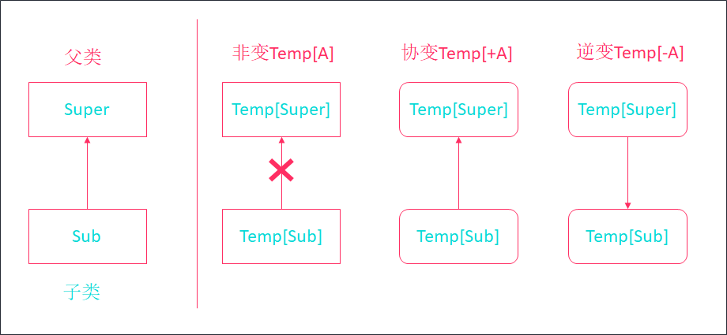

# Scala第十六章节

### 章节目标

1. 掌握泛型方法, 类, 特质的用法
2. 了解泛型上下界相关内容
3. 了解协变, 逆变, 非变的用法
4. 掌握列表去重排序案例

------

### 1. 泛型

泛型的意思是`泛指某种具体的数据类型`,  在Scala中, 泛型用`[数据类型]`表示. 在实际开发中, 泛型一般是结合数组或者集合来使用的, 除此之外, 泛型的常见用法还有以下三种:

* 泛型方法
* 泛型类
* 泛型特质

#### 1.1 泛型方法

泛型方法指的是`把泛型定义到方法声明上, 即:该方法的参数类型是由泛型来决定的`. 在调用方法时, 明确具体的数据类型.

**格式**

```scala
def 方法名[泛型名称](..) = {
    //...
}
```

**需求**

定义方法getMiddleElement(), 用来获取任意类型数组的中间元素.
- 思路一: 不考虑泛型直接实现（基于Array[Int]实现）
- 思路二: 加入泛型支持.

**参考代码**

```scala
//案例: 泛型方法演示.
//细节: 泛型方法在调用方法的时候 明确具体的数据类型.
object ClassDemo01 {
  //需求: 用一个方法来获取任意类型数组的中间的元素
  //思路一:不考虑泛型直接实现（基于Array[Int]实现）
  //def getMiddleElement(arr: Array[Int]) = arr(arr.length / 2)

  //思路二: 加入泛型支持
  def getMiddleElement[T](arr: Array[T]) = arr(arr.length / 2)

  def main(args: Array[String]): Unit = {
      //调用方法
      println(getMiddleElement(Array(1, 2, 3, 4, 5)))

      println(getMiddleElement(Array("a", "b", "c")))
  }
}
```


#### 1.2 泛型类

泛型类指的是`把泛型定义到类的声明上, 即:该类中的成员的参数类型是由泛型来决定的`. 在创建对象时, 明确具体的数据类型.

**格式**

```scala
class 类[T](val 变量名: T)
```

**需求**

1. 定义一个Pair泛型类, 该类包含两个字段，且两个字段的类型不固定.
2. 创建不同类型的Pair泛型类对象，并打印.

**参考代码**

```scala
//案例: 泛型-演示泛型类的使用.
//泛型类: 在创建对象的时候, 明确具体的数据类型.
object ClassDemo02 {
  //1. 实现一个Pair泛型类
  //2. Pair类包含两个字段，而且两个字段的类型不固定
  class Pair[T](var a:T, var b:T)

  def main(args: Array[String]): Unit = {
    //3. 创建不同类型泛型类对象，并打印
    var p1 = new Pair[Int](10, 20)
    println(p1.a, p1.b)

    var p2 = new Pair[String]("abc", "bcd")
    println(p2.a, p2.b)
  }
}
```


#### 1.3 泛型特质

泛型特质指的是`把泛型定义到特质的声明上, 即:该特质中的成员的参数类型是由泛型来决定的`. 在定义泛型特质的子类或者子单例对象时, 明确具体的数据类型.

**格式**

```scala
trait 特质A[T] {
  //特质中的成员
}

class 类B extends 特质A[指定具体的数据类型] {
  //类中的成员
}
```

**需求**

1. 定义泛型特质Logger, 该类有一个变量a和show()方法, 它们都是用Logger特质的泛型.
2. 定义单例对象ConsoleLogger, 继承Logger特质.
3. 打印单例对象ConsoleLogger中的成员.

**参考代码**

```scala
//案例: 演示泛型特质.
object ClassDemo03 {
  //1. 定义泛型特质Logger, 该类有一个a变量和show()方法, 都是用Logger特质的泛型.
  trait Logger[T] {
    //定义变量
    val a:T

    //定义方法.
    def show(b:T) = println(b)
  }

  //2. 定义单例对象ConsoleLogger, 继承Logger特质.
  object ConsoleLogger extends Logger[String]{
    override val a: String = "张三"
  }

  //main方法, 作为程序的主入口.
  def main(args: Array[String]): Unit = {
    //3. 打印单例对象ConsoleLogger中的成员.
    println(ConsoleLogger.a)
    ConsoleLogger.show("10")
  }
}

```


### 2. 上下界

我们在使用泛型(方法, 类, 特质)时，如果要限定该泛型必须从哪个类继承、或者必须是哪个类的父类。此时，就需要使用到`泛型的上下界`。

#### 2.1 上界

使用`T <: 类型名`表示给类型添加一个**上界**，表示泛型参数必须要从该类（或本身）继承.

**格式**

    [T <: 类型]
> 例如: [T <: Person]的意思是, 泛型T的数据类型**必须是Person类型或者Person的子类型**

**需求**

1. 定义一个Person类
2. 定义一个Student类，继承Person类
3. 定义一个泛型方法demo()，该方法接收一个Array参数.
4. 限定demo方法的Array元素类型只能是Person或者Person的子类
5. 测试调用demo()方法，传入不同元素类型的Array

**参考代码**

```scala
//案例: 演示泛型的上下界之  上界.
object ClassDemo04 {
  //1. 定义一个Person类
  class Person

  //2. 定义一个Student类，继承Person类
  class Student extends Person

  //3. 定义一个demo泛型方法，该方法接收一个Array参数，
  //限定demo方法的Array元素类型只能是Person或者Person的子类
  def demo[T <: Person](arr: Array[T]) = println(arr)

  def main(args: Array[String]): Unit = {
    //4. 测试调用demo，传入不同元素类型的Array
    //demo(Array(1, 2, 3))          //这个会报错, 因为只能传入Person或者它的子类型.

    demo(Array(new Person()))
    demo(Array(new Student()))
  }
}

```


#### 2.2 下界

使用`T >: 数据类型`表示给类型添加一个**下界**，表示泛型参数必须是从该类型本身或该类型的父类型.

**格式**

```scala
[T >: 类型]
```

> 注意:
>
> 1. 例如: [T >: Person]的意思是, 泛型T的数据类型**必须是Person类型或者Person的父类型**
> 2. 如果泛型既有上界、又有下界。下界写在前面，上界写在后面. 即: **[T >: 类型1  <: 类型2]**

**需求**

1. 定义一个Person类
2. 定义一个Policeman类，继承Person类
3. 定义一个Superman类，继承Policeman类
4. 定义一个demo泛型方法，该方法接收一个Array参数，
5. 限定demo方法的Array元素类型只能是Person、Policeman
6. 测试调用demo，传入不同元素类型的Array

**参考代码**

```scala
//案例: 演示泛型的上下界之 下界.
//如果你在设定泛型的时候, 涉及到既有上界, 又有下界, 一定是: 下界在前, 上界在后.
object ClassDemo05 {
  //1. 定义一个Person类
  class Person
  //2. 定义一个Policeman类，继承Person类
  class Policeman extends Person
  //3. 定义一个Superman类，继承Policeman类
  class Superman extends Policeman

  //4. 定义一个demo泛型方法，该方法接收一个Array参数，
  //限定demo方法的Array元素类型只能是Person、Policeman。这个时候使用下界
  // 下面的写法只允许Policeman类型
  //          下界          上界
  def demo[T >: Policeman <: Policeman](arr: Array[T]) = println(arr)

  def main(args: Array[String]): Unit = {
    //5. 测试调用demo，传入不同元素类型的Array
    //demo(Array(new Person))
    demo(Array(new Policeman))
    //demo(Array(new Superman))     //会报错, 因为只能传入: Policeman类获取它的父类型, 而Superman是Policeman的子类型, 所以不行.
  }
}
```


### 3. 协变、逆变、非变

在Spark的源代码中大量使用到了协变、逆变、非变，学习该知识点对我们将来阅读spark源代码很有帮助。

* 非变: 类A和类B之间是父子类关系, 但是Pair[A]和Pair[B]之间没有`任何关系`.
* 协变: 类A和类B之间是父子类关系, Pair[A]和Pair[B]之间也有`父子类`关系.
* 逆变: 类A和类B之间是父子类关系, 但是Pair[A]和Pair[B]之间是`子父类`关系.

如下图: 



#### 3.1 非变

**语法格式**

```scala
class Pair[T]{}
```

- 默认泛型类是`非变的`
- 即: 类型B是A的子类型，Pair[A]和Pair[B]没有任何从属关系

#### 3.2 协变

**语法格式**

```scala
class Pair[+T]
```

- 类型B是A的子类型，Pair[B]可以认为是Pair[A]的子类型
- 参数化类型的方向和类型的方向是一致的。

#### 3.3 逆变

**语法格式**

```scala
class Pair[-T]
```

- 类型B是A的子类型，Pair[A]反过来可以认为是Pair[B]的子类型
- 参数化类型的方向和类型的方向是相反的

#### 3.4 示例

**需求**

1. 定义一个Super类、以及一个Sub类继承自Super类
2. 使用协变、逆变、非变分别定义三个泛型类
3. 分别创建泛型类对象来演示协变、逆变、非变

**参考代码**

```scala
//案例: 演示非变, 协变, 逆变.
object ClassDemo06 {
  //1. 定义一个Super类、以及一个Sub类继承自Super类
  class Super               //父类
  class Sub extends Super   //子类

  //2. 使用协变、逆变、非变分别定义三个泛型类
  class Temp1[T]            //非变
  class Temp2[+T]           //协变
  class Temp3[-T]           //逆变.

  def main(args: Array[String]): Unit = {
    //3. 分别创建泛型类来演示协变、逆变、非变
    //演示非变.
    val t1:Temp1[Sub] = new Temp1[Sub]
    //val t2:Temp1[Super] = t1          //编译报错, 因为非变是: Super和Sub有父子类关系, 但是Temp1[Super] 和 Temp1[Sub]之间没有关系.

    //演示协变
    val t3:Temp2[Sub] = new Temp2[Sub]
    val t4:Temp2[Super] = t3          //不报错, 因为协变是: Super和Sub有父子类关系, 所以Temp2[Super] 和 Temp2[Sub]之间也有父子关系.
                                      //Temp2[Super]是父类型,   Temp2[Sub]是子类型.

    //演示逆变
    val t5:Temp3[Super]  = new Temp3[Super]
    val t6:Temp3[Sub] = t5          //不报错, 因为逆变是:  Super和Sub有父子类关系, 所以Temp3[Super] 和 Temp3[Sub]之间也有子父关系.
                                    //Temp3[Super]是子类型,   Temp3[Sub]是父类型.
  }
}
```


### 4. 案例: 列表去重排序

#### 4.1 需求

1. 已知当前项目下的data文件夹中有一个1.txt文本文件, 文件内容如下: 

   ```scala
   11
   6
   5
   3
   22
   9
   3
   11
   5
   1
   2
   ```

2. 对上述数据去重排序后, 重新写入到data文件夹下的2.txt文本文件中, 即内容如下:

   ```scala
   1
   2
   3
   5
   6
   9
   11
   22
   ```

#### 4.2 目的

考察`泛型, 列表, 流`相关的内容.

#### 4.3 参考代码

```scala
import java.io.{BufferedWriter, FileWriter}
import scala.io.Source

//案例: 列表去重排序, 并写入文件.
object ClassDemo07 {
  def main(args: Array[String]): Unit = {
    //1. 定义数据源对象.
    val source = Source.fromFile("./data/1.txt")
    //2. 从指定文件中读取所有的数据(字符串形式)
    val list1:List[String] = source.mkString.split("\\s+").toList
    //3. 把List[String]列表转换成List[Int]
    val list2:List[Int] = list1.map(_.toInt)
    //4. 把List[Int]转换成Set[Int], 对列表元素去重.
    val set:Set[Int] = list2.toSet
    //5. 把Set[Int]转成List[Int], 然后升序排列
    val list3:List[Int] = set.toList.sorted
    //println(list3)
    //6. 把数据重新写入到data文件夹下的2.txt文件中.
    val bw = new BufferedWriter(new FileWriter("./data/2.txt"))
    for(i <- list3) {
      bw.write(i.toString)
      bw.newLine()    //别忘记加换行
    }
    //7. 释放资源
    bw.close()
  }
}
```


